# Análisis Comparativo: Datos Sintéticos vs. Datos Reales (Fase 1 y 2)

Este documento presenta una comparación detallada de las métricas, comportamientos y distribuciones del proyecto entre la primera ejecución basada en datos sintéticos y la segunda ejecución basada en los datasets reales (`entity_source_results.csv` y `evidence_items.csv`).

---

## 1. Fase 1: Resolución de Entidades y Embeddings

En esta fase, la principal diferencia radica en el tamaño de las muestras y la complejidad de las variantes resultantes de los nombres de las entidades.

| Métrica / Parámetro | Escenario 1: Datos Sintéticos | Escenario 2: Datos Reales | Variación / Observación |
| :--- | :---: | :---: | :--- |
| **Entidades Totales** | 10,000 | 4,962 | -50.38% (Tamaño de catálogo real) |
| **Nombres Base Únicos** | 8,768 | 4,617 | 93.04% de unicidad en real |
| **Variantes de Nombres** | 50,674 | 25,061 | ~5 variantes promedio por entidad |
| **Pares Evaluados (Blocking)**| 9,453,802 | 380,621 | **-95.97%** en carga computacional |
| **Umbral de Confianza Alta (`high_min`)** | 0.8700 | 1.0000 | Aumento debido a mayor densidad de variantes exactas en real |
| **Umbral de Confianza Media (`medium_min`)**| 0.7100 | 0.7525 | Umbral mínimo real más estricto |
| **ROC AUC (TF-IDF)** | 0.8175 | 0.8100 | Estabilidad en la capacidad de separación |
| **PR AUC (TF-IDF)** | 0.8055 | 0.8344 | **+3.58%** de mejora de precisión media en real |

### Comparativa de Backends de Embeddings (Datos Reales):
Con la integración del backend local de Hugging Face (`sentence-transformers`), se evaluaron y compararon las tres soluciones sobre la muestra real de validación:

* **TF-IDF (Local)**: ROC-AUC = **0.8100** | PR-AUC = **0.8344**
* **Sentence-Transformers (`all-MiniLM-L6-v2` Local)**: ROC-AUC = **0.6875** | PR-AUC = **0.7538**
* **OpenAI (`text-embedding-3-small` Remoto)**: No evaluado en corrida real por cuota insuficiente (`insufficient_quota`).

> **Conclusión Metodológica**: TF-IDF a nivel de caracteres (n-gramas 1-3) supera en rendimiento a los embeddings densos locales de Sentence-Transformers para resolver variantes de nombres. Esto se debe a que la variación en nombres propios (errores tipográficos, sufijos, transposiciones) se modela de manera óptima por sub-tokens ortográficos de caracteres, mientras que los embeddings semánticos entrenados en lenguaje natural general sufren al interpretar nombres propios desconocidos o tokens de iniciales muy cortas.

> La drástica reducción de pares candidatos en el bloqueo (-95.97%) se debe al filtro rápido que optimiza la comparación. Esto reduce los requerimientos de memoria y CPU, haciendo viable la ejecución del pipeline completo en pocos segundos.

---

## 2. Fase 2: Distribución de la Clase y Alertas AML

La distribución de riesgo en el dataset sintético estaba artificialmente inflada en comparación con la distribución del comportamiento de alertas en los datos reales de producción.

```mermaid
gantt
    title Distribución de Clases de Riesgo AML
    dateFormat  X
    axisFormat %s
    section Datos Sintéticos
    Riesgo (74.72%) :active, 0, 7472
    Sin Riesgo (25.28%) : 7472, 10000
    section Datos Reales
    Riesgo (16.95%) :active, 0, 1695
    Sin Riesgo (83.05%) : 1695, 10000
```

* **Datos Sintéticos (Riesgo inflado)**: 
  * Riesgo AML (`1`): **74.72%** (7,472 registros)
  * Sin riesgo (`0`): **25.28%** (2,528 registros)
* **Datos Reales (Riesgo balanceado operativamente)**:
  * Riesgo AML (`1`): **16.95%** (841 registros)
  * Sin riesgo (`0`): **83.05%** (4,121 registros)

> [!IMPORTANT]
> La distribución real de **16.95%** de entidades de riesgo crítico es mucho más representativa para un escenario operativo real. En cumplimiento de prevención de lavado de dinero, un porcentaje del 74.72% saturaría de inmediato a los equipos de analistas (alertamiento masivo o "ruido"). El escenario real reduce drásticamente los falsos positivos.

---

## 3. Fase 2: Desempeño y Selección de Modelos

El cambio en la distribución del target alteró los pesos del modelado y la optimización de hiperparámetros.

| Métrica de Validación | Sintéticos: Mejor Modelo (Árbol de Decisión) | Reales: Mejor Modelo (Random Forest) |
| :--- | :---: | :---: |
| **Modelo Seleccionado** | `baseline_2_tree` | `baseline_3_rf` |
| **Accuracy** | 1.0000 | 0.9990 |
| **Precision** | 1.0000 | 0.9941 |
| **Recall (Sensibilidad)** | 1.0000 | 1.0000 |
| **F1-Score** | 1.0000 | 0.9970 |
| **PR-AUC** | 1.0000 | 1.0000 |
| **ROC-AUC** | 1.0000 | 1.0000 |

* **Selección del Clasificador**:
  * Con **datos sintéticos**, el **Árbol de Decisión** fue elegido por simplicidad debido a métricas perfectas (1.00).
  * Con **datos reales**, el clasificador **Random Forest** superó al árbol simple tras la validación cruzada por grid (`average_precision` CV = 1.0000 vs 0.9986), ofreciendo una mayor robustez y generalización en distribuciones desbalanceadas.

---

## 4. Distribución de Niveles de Riesgo Continuo (OSINT Risk Score)

El Score Continuo de Priorización Operativa (`osint_risk_score`) se distribuyó de la siguiente manera:

* **Escenario Sintético (10,000 registros)**:
  * **Bajo**: 3,352 registros.
  * **Medio**: 3,256 registros.
  * **Alto**: 3,392 registros.
* **Escenario Real (4,962 registros)**:
  * **Bajo**: 2,296 registros.
  * **Medio**: 1,047 registros.
  * **Alto**: 1,619 registros.

